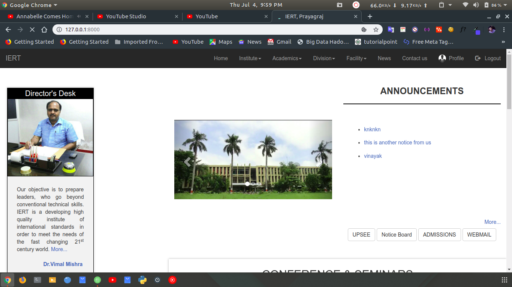
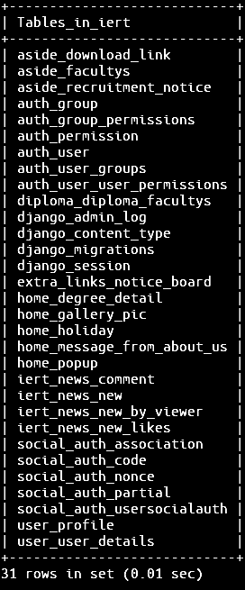
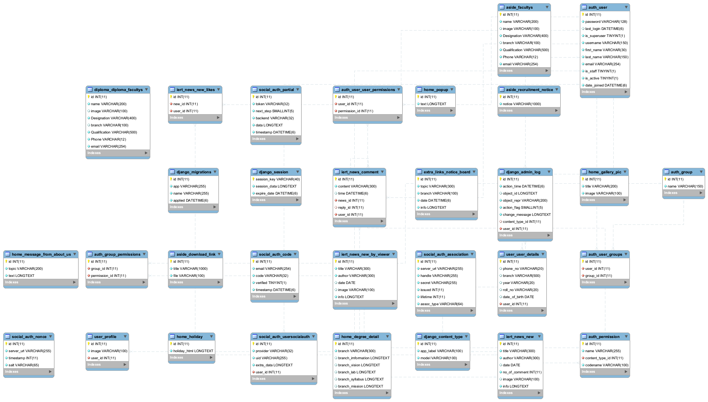

<h1 align="center">IERT DJANGO WEBAPP</h1>

&nbsp; &nbsp;

This is my college website created using python (django framework) at backend . Some of the features of website include implementation of login/logout system for students , it's a responsive website which is also a standalone progressive web app and provide dynamic notification and content from backend.

# Django

Django is an open-source python web framework used for rapid development, pragmatic, maintainable, clean design, and secures websites. A web application framework is a toolkit of all components need for application development. The main goal of the Django framework is to allow developers to focus on components of the application that are new instead of spending time on already developed components. Django is fully featured than many other frameworks on the market. It takes care of a lot of hassle involved in the web development; enables users to focus on developing components needed for their application.

## Virtualenv & Dependencies

create a virtualenv and run requirements.txt 
<b>virtualenv</b>

<pre>pip install virtualenv</pre>

<b> what is virtual environment ? </b> 
A virtual environment is a tool that helps to keep dependencies required by different projects separate by creating isolated python virtual environments for them. This is one of the most important tools that most of the Python developers use.
 
<a href="https://www.geeksforgeeks.org/python-virtual-environment/" >read more... </a>

to run requirements.txt

<pre>$ pip install -r requirements.txt</pre>
 
here <b>env/</b> folder contains all dependencies

## Running locally

<ol>
  <li>
      clone repository 
      <pre>$ git clone https://github.com/itsvinayak/iert_django_webapp.git</pre>
  </li>
  <li>
     make database settings and connect it to your local database 
    <pre>$ cd ./src/iert </pre>
    open <b>settings.py</b> file
    <pre>
                DATABASES = {
            "default": {
                "ENGINE": "django.db.backends.mysql",
                "NAME": "iert",
                "USER": "root",
                "HOST": "localhost",
                "PASSWORD": "vinayak",
                "PORT": "3306",
                "OPTIONS": {"sql_mode": "traditional"},
            }
        }
   </pre>
   set this part according to needs.
  </li>
  <li>
    run migrations 
    <pre>$ python manage.py migrate</pre>
  </li>
  <li>
    now, runserver 
    <pre>$ python manage.py runserver</pre>
  </li>
 </ol>

here <b>env/</b> folder contains all dependencies

## Running locally

<ol>
  <li>
      clone repository 
      <pre>$ git clone https://github.com/itsvinayak/iert_django_webapp.git</pre>
  </li>
  <li>
     make database settings and connect it to your local database 
    <pre>$ cd ./src/iert </pre>
    open <b>settings.py</b> file
    <pre>
                DATABASES = {
            "default": {
                "ENGINE": "django.db.backends.mysql",
                "NAME": "iert",
                "USER": "root",
                "HOST": "localhost",
                "PASSWORD": "vinayak",
                "PORT": "3306",
                "OPTIONS": {"sql_mode": "traditional"},
            }
        }
   </pre>
   set this part according to needs.
  </li>
  <li>
    run migrations 
    <pre>$ python manage.py migrate</pre>
  </li>
  <li>
    now, runserver 
    <pre>$ python manage.py runserver</pre>
  </li>
 </ol>

## Screenshot

  

## Features

<ul>
  <li>responsive bootstrap design </li>
  <li>user login and registration feature</li>
  <li>news section with users feedback (like and comment button include )</li>
  <li>API include using DjangoRestFramework</li>
</ul>

## Tables

  

  mysql commands to use

  <ul>
  <li>
      To open database
      <pre>$ mysql -u username -p password</pre>
  </li>
  <li>
    To select database
    <pre>$ use database_name;</pre>
  </li>
  <li>
    To see tables
    <pre>$ show tables;</pre>
 </li>
</ul>

## ER  Diagram

  

## Contributing

Bug reports and pull requests are welcome on GitHub at https://github.com/itsvinayak/iert_django_webapp 

<strong>made by vinayak with 💕 and 💻</strong>
